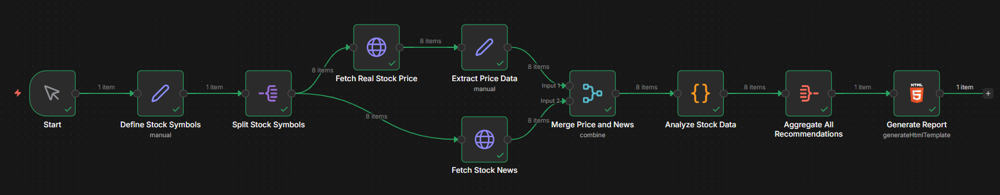

# 📊 Stock Market Analysis Workflow (n8n)



## 🚀 Project Overview

This project is an **automated stock market analysis workflow** built using **n8n**. It collects real-time stock price data, fetches related financial news, analyzes both using rule-based logic, and generates a consolidated investment recommendation report.

The workflow is designed to:

* Process **multiple stocks in parallel**
* Combine **price action + news sentiment**
* Avoid paid AI APIs and heavy dependencies
* Produce a clean **HTML-based analytical report**

> ⚠️ This project is for **educational and research purposes only**. It does not provide financial advice.

---

## 🎯 Purpose

Manual stock research is time-consuming. This workflow automates the research pipeline by:

* Fetching live market data
* Monitoring stock-related news
* Applying consistent, explainable logic
* Producing structured recommendations

It is suitable for:

* Daily stock screening
* Portfolio monitoring
* College / final-year projects
* Automation demonstrations

---

## 🛠️ Tech Stack

| Component           | Technology                             | Purpose                              |
| ------------------- | -------------------------------------- | ------------------------------------ |
| Workflow Automation | **n8n**                                | Orchestrates data flow and execution |
| Stock Price Data    | **HTTP Request Node**                  | Fetches real-time stock prices       |
| News Data           | **HTTP Request (RSS)**                 | Retrieves latest stock news          |
| Data Processing     | **Code / Function Nodes (JavaScript)** | Calculates metrics and sentiment     |
| Data Transformation | **Edit / Set Nodes**                   | Cleans and structures data           |
| Aggregation         | **Aggregate Node**                     | Compiles final recommendations       |
| Output              | **HTML Generator Node**                | Renders browser-based report         |

---

## 🔄 Workflow Architecture

```
Start
  → Define Stock Symbols
    → Split Stock Symbols
      → [ Fetch Stock Price  ||  Fetch Stock News ]
        → Merge Price & News
          → Analyze Stock Data
            → Aggregate Recommendations
              → Generate HTML Report
```

Parallel execution ensures faster processing when analyzing many stocks.

---

## 📋 Node-by-Node Breakdown

### 1️⃣ Start

**Type:** Manual Trigger
**Purpose:** Initiates the workflow manually for testing or ad-hoc execution.

---

### 2️⃣ Define Stock Symbols

**Type:** Code / Set Node
**Purpose:** Defines the list of stocks to analyze.

**What it does:**

* Creates an array of stock objects
* Each object contains:

  * Stock symbol
  * Company name

**Example Output:**

```json
{
  "symbol": "AAPL",
  "name": "Apple Inc."
}
```

This node controls which stocks are included in the analysis.

---

### 3️⃣ Split Stock Symbols

**Type:** Split Out / Item Lists Node
**Purpose:** Breaks the stock list into individual items.

**Why this matters:**

* Enables **parallel processing**
* Each stock is handled independently

---

### 4️⃣ Fetch Real Stock Price

**Type:** HTTP Request Node
**Purpose:** Retrieves live or recent stock price data.

**What it does:**

* Calls a public stock data API (e.g., Yahoo Finance, Alpha Vantage)
* Fetches:

  * Current price
  * Price change
  * Volume (if available)

**Output Example:**

```json
{
  "symbol": "AAPL",
  "price": 178.50,
  "change": 2.3,
  "volume": 52000000
}
```

---

### 5️⃣ Extract Price Data

**Type:** Code / Edit Fields Node
**Purpose:** Normalizes the raw price API response.

**What it does:**

* Extracts required numeric fields
* Removes unnecessary API metadata
* Prepares data for merging

---

### 6️⃣ Fetch Stock News

**Type:** HTTP Request Node (RSS)
**Purpose:** Retrieves recent news articles related to the stock.

**What it does:**

* Fetches RSS feeds or public news endpoints
* Extracts:

  * Headlines
  * Descriptions
  * Publish timestamps

Runs **in parallel** with price fetching.

---

### 7️⃣ Merge Price and News

**Type:** Merge Node (Combine)
**Purpose:** Combines price data and news data into a single object.

**What it does:**

* Waits for both branches to finish
* Merges data for the same stock
* Ensures analysis has full context

---

### 8️⃣ Analyze Stock Data

**Type:** Code Node
**Purpose:** Core decision-making logic.

**Analysis Performed:**

**Price Momentum**

* Strong: > 5% change
* Moderate: 2–5%
* Weak: < 2%

**News Sentiment (Rule-Based)**

* Positive keyword detection (growth, profit, expansion)
* Negative keyword detection (loss, lawsuit, decline)

**Recommendation Logic**

* Combines momentum + sentiment
* Produces:

  * BUY
  * HOLD
  * AVOID

**Output Example:**

```json
{
  "symbol": "AAPL",
  "recommendation": "BUY",
  "confidence": 85,
  "reasoning": "Strong momentum with positive news sentiment"
}
```

---

### 9️⃣ Aggregate All Recommendations

**Type:** Aggregate Node
**Purpose:** Compiles results from all stocks.

**What it does:**

* Collects individual analyses
* Creates a unified dataset
* Prepares data for reporting

---

### 🔟 Generate Report

**Type:** HTML Generator Node
**Purpose:** Produces a visual dashboard.

**What it does:**

* Converts aggregated data into HTML
* Displays:

  * Stock name & symbol
  * Score & recommendation
  * Reasoning
* Renders directly in browser via webhook

---

## ✨ Key Features

* ✅ Parallel stock processing
* ✅ Rule-based, explainable logic
* ✅ No paid AI APIs required
* ✅ Clean HTML dashboard output
* ✅ Easily extensible

---

## 📈 Use Cases

* Daily stock screening
* Portfolio monitoring
* Academic projects
* Automation demos
* Data engineering showcases

---

## 🔧 Customization Options

* Add or remove stocks in **Define Stock Symbols**
* Modify scoring logic in **Analyze Stock Data**
* Add technical indicators (RSI, MA)
* Schedule daily execution with Cron Trigger
* Export results as JSON / CSV

---

## ⚠️ Disclaimer

This system is for **educational and informational purposes only**.
It does **not** provide financial or investment advice.

<p align="center">
  <i>Made with ❤️ by Ruthvik Sharma</i>
</p>
